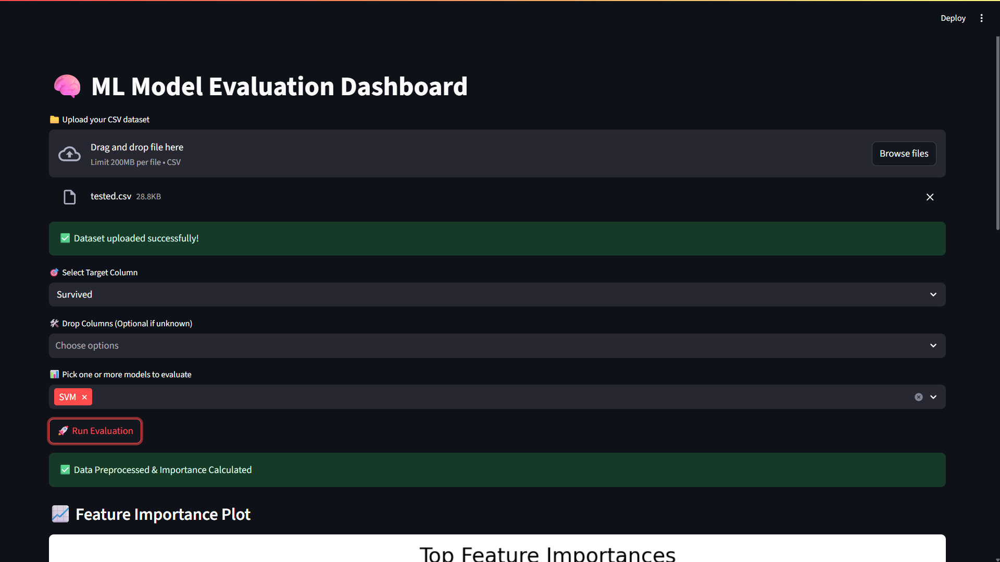

# ML-Model-Evaluation-Dashboard-Scripted

A modular and easy-to-use machine learning model evaluation tool with both **Streamlit UI** and **command-line interface (CLI)** support. The goal is to allow fast and flexible experimentation on tabular datasets for classification tasks — especially to understand how feature selection (including PCA) impacts model performance.

---

## 🚀 Features

* Upload any tabular CSV dataset
* Select target column and drop irrelevant columns
* Automatically apply PCA if high dimensionality is detected
* Perform feature selection:

  * Elbow method (auto)
  * Manual top-N features
* Evaluate using Logistic Regression
* Get precision, recall, F1-score, and support metrics
* Works both via:

  * 📊 Streamlit UI
  * 🔧 Command-line script

---

## 💻 Streamlit UI: How to Run

### ▶️ Steps:

1. Clone this repo

   ```bash
   git clone https://github.com/RohitXJ/ML-Model-Evaluation-Dashboard-Scripted.git
   cd ML-Model-Evaluation-Dashboard-Scripted
   ```

2. Create a virtual environment (recommended)

   ```bash
   python -m venv venv
   source venv/bin/activate   # On Windows: venv\Scripts\activate
   ```

3. Install required packages

   ```bash
   pip install -r requirements.txt
   ```

4. Run the Streamlit app

   ```bash
   cd streamlit_app_version
   streamlit run streamlit_app.py
   ```

### 🧪 Then:

* Upload your CSV file.
* Choose the target column to predict.
* Optionally drop any irrelevant columns.
* Select feature selection method.
* Click **Proceed** to get model evaluation results!

---

## 💻 Terminal Version: How to Run

You can also run the same logic directly in the terminal:

### ▶️ Steps:

1. Clone this repo

   ```bash
   git clone https://github.com/RohitXJ/ML-Model-Evaluation-Dashboard-Scripted.git
   cd ML-Model-Evaluation-Dashboard-Scripted
   ```

2. Create a virtual environment (recommended)

   ```bash
   python -m venv venv
   source venv/bin/activate   # On Windows: venv\Scripts\activate
   ```

3. Install required packages

   ```bash
   pip install -r requirements.txt
   ```

4. Run the script

   ```bash
   python main.py
   ```

---

## 📦 Requirements

Install with:

```bash
pip install -r requirements.txt
```

**Key libraries used:**

* `pandas`
* `numpy`
* `scikit-learn`
* `matplotlib`
* `seaborn`
* `streamlit`

---

## 📸 Screenshots

 <!-- Replace with actual image path -->

---

## 👥 Author & Contact

**Rohit Gomes**
B.Tech CSE (AI & ML) | Brainware University
LinkedIn: [@rohit-gomes](https://www.linkedin.com/in/rohit-gomes-12209620a)
Email: [gomesrohit92@gmail.com](mailto:gomesrohit92@gmail.com)
GitHub: [@RohitXJ](https://github.com/RohitXJ)

---

## 🙌 Contributions

Pull requests are welcome. For major changes, please open an issue first to discuss your ideas.

---

## 📝 License

MIT License
